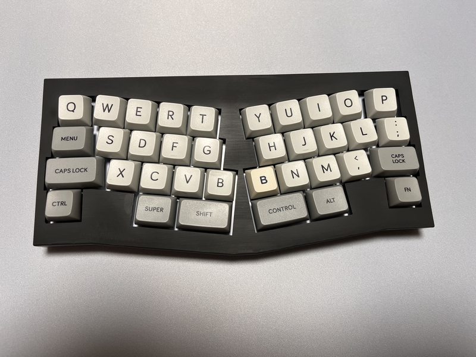
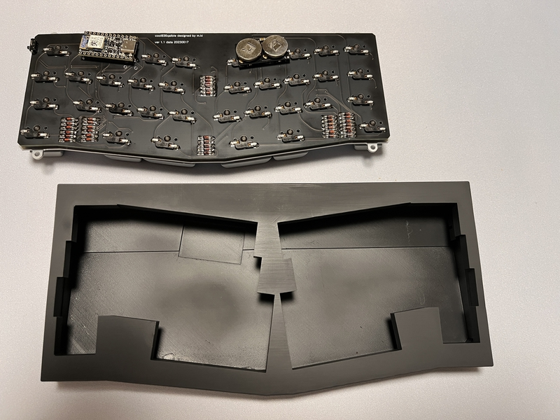

# cool836qalble

A newly designed keyboard inspired by QAZ's Alice layout QAL and QALBLE. 
cool836qal uses RP2040-zero and runs on QMK_Firmware. 
cool836qalble is the bluetooth version of cool836qal.
  
QAZのAliceレイアウトであるQALおよびQALBLEに影響を受けて、新しく設計したキーボードです。  cool836qalbleはBle Microを使い、QMK_Firmwareで動きます。 
cool836qalbleは cool836qalのブルートゥース版になります。
 

# Build guide

https://github.com/telzo2000/cool836qalble/blob/main/build_guide_cool836qalble.md

# remap
https://remap-keys.app/catalog/FEmXx8GyuKYuJ5JSfcQG

# Parts List

| No. | Patrs | Quantity | remarks | Suppliers | Cost |
|--|--|--|--|--|--|
|番号|名前|数|備考|調達先|参考価格（送料込）| 
|1|PCB|1|36key AlicLayout|[elecrow](https://www.elecrow.com) [JLCPCB](https://jlcpcb.com) [ALLPCB](https://www.allpcb.com)|５枚で20〜30ドル| 
|2|Switch Plate|1||[elecrow](https://www.elecrow.com) [JLCPCB](https://jlcpcb.com) [ALLPCB](https://www.allpcb.com)|５枚で20〜30ドル| 
|3|Ble Micro|1||[遊舎工房](https://shop.yushakobo.jp/products/ble-micro-pro?_pos=1&_sid=c1171a4b2&_ss=r) [のぎすけ屋](https://booth.pm/ja/items/1177319)|4500〜4950円|
|4|電池基板|1|Ble Micro Pro用|[遊舎工房](https://shop.yushakobo.jp/products/ble-micro-pro-battery-board?pr_prod_strat=copurchase&pr_rec_id=30df01db7&pr_rec_pid=6055679066273&pr_ref_pid=6055716126881&pr_seq=uniform) [のぎすけ屋](https://nogikes.booth.pm/items/1655285)|495〜500円|
|5|水平スライドスイッチ|1||[遊舎工房](https://shop.yushakobo.jp/products/5624?_pos=1&_sid=f65b70e3c&_ss=r)|110円|
|6|Swith socket スイッチソケット|36|cherry MX互換|[遊舎工房](https://yushakobo.jp) [Talp Keyboard](https://talpkeyboard.net) [Daily Craft Keyboard](https://shop.dailycraft.jp)等|10個で165円程度|
|7|Diode ダイオード|36|リードタイプでもSMDでも可|[遊舎工房](https://yushakobo.jp) [Talp Keyboard](https://talpkeyboard.net) [Daily Craft Keyboard](https://shop.dailycraft.jp)等|100個で220円程度から|
|8|TopCase|1|3D Print|||
|9|BottomCase|1|3D Print||
|10|Switch Parts|1|3D Print||

In addition, you will need a USB cable, keycaps, etc.
 
この他に、USBケーブル、キーキャップ等が必要です。
 